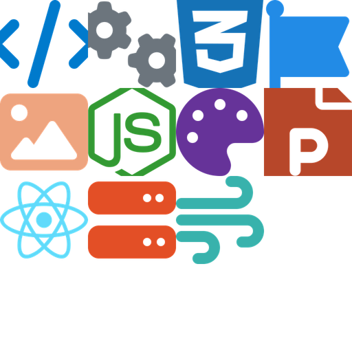

# nobuddy.org

[](https://github.com/nobuddyorg/nobuddyorg.github.io/actions/workflows/pages-deploy.yml)
[](https://github.com/nobuddyorg/nobuddyorg.github.io/actions/workflows/ci.yml)
[](https://github.com/nobuddyorg/nobuddyorg.github.io/security/code-scanning)


[](https://github.com/nobuddyorg/nobuddyorg.github.io/commits/main)
[](LICENSE)


**Creative tools for nerds.** This repo is the portal site for
[nobuddy.org](https://nobuddy.org) — the front door to a growing collection
of small, self-contained "Buddy" apps, each living in its own repo under the
[nobuddyorg](https://github.com/nobuddyorg) org. No corporate roadmap, no
investors: just tools built out of curiosity, shipped when they're fun, and
fully open source.

The site itself is a Next.js app in [`web-buddy/`](web-buddy/), statically
exported and deployed to GitHub Pages.

## The Buddies

Every tool has its own repo under the [nobuddyorg](https://github.com/nobuddyorg)
org and its own README — this one doesn't keep a duplicate list, since that
list would only ever drift out of sync. The current, accurate catalog lives
on the site itself: [nobuddy.org/tools](https://nobuddy.org/tools).



## Development

Prerequisites: Node 22 (see `web-buddy/.nvmrc`).

```bash
cd web-buddy
npm ci
npm run dev       # dev server at http://localhost:3000
```

Other useful commands (run from `web-buddy/`):

```bash
npm run lint       # ESLint
npm run build      # static export to web-buddy/out
npm run test:e2e   # Playwright e2e tests (requires a prior build; see below)
```

The Playwright suite runs against the static export, so build first:

```bash
npm run build
npx playwright test
```

From the repo root, `./build.sh` does a full local sanity check: a clean
`npm ci` + `npm run build` of `web-buddy/`, producing `web-buddy/out/`.

## Deployment

Pushes to `main` automatically build and deploy the site to
[nobuddy.org](https://nobuddy.org) via `.github/workflows/pages-deploy.yml`.

## Contributing

Every Buddy is a normal open-source repo: fork it, run it locally, send a
PR. This portal repo follows the same rules — see the workflows in
[`.github/workflows/`](.github/workflows/) for what CI checks on every push.
